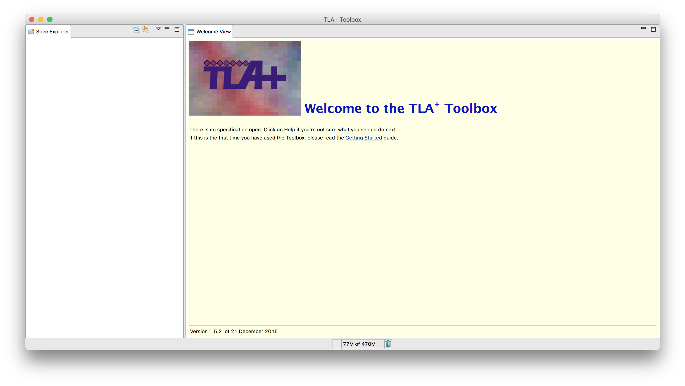
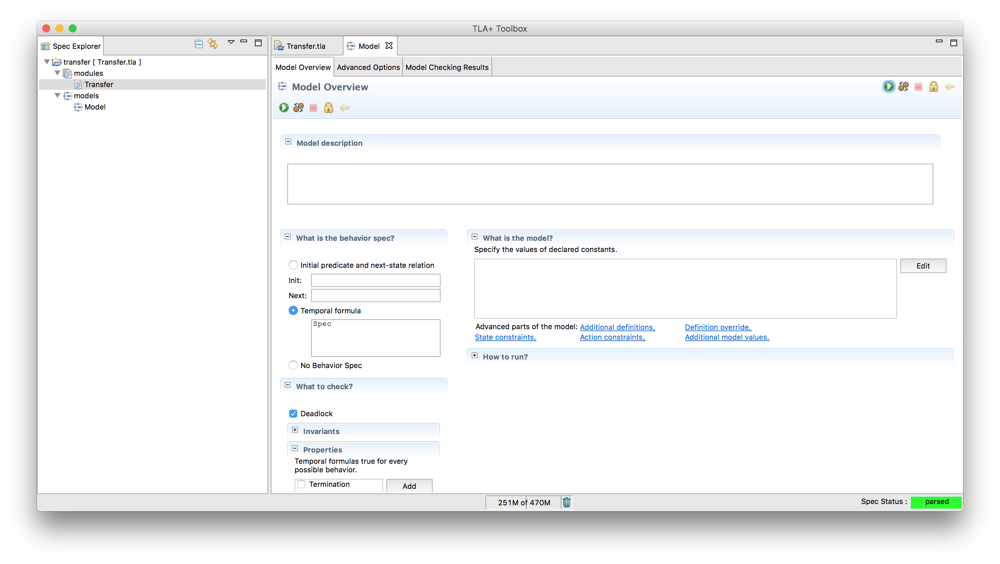
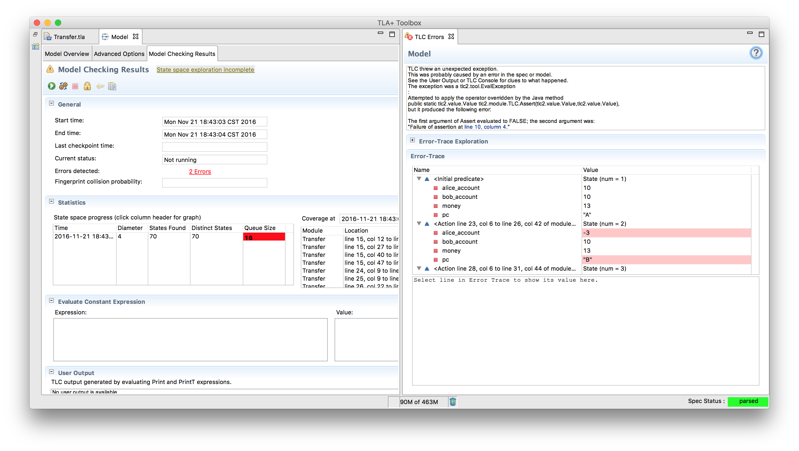
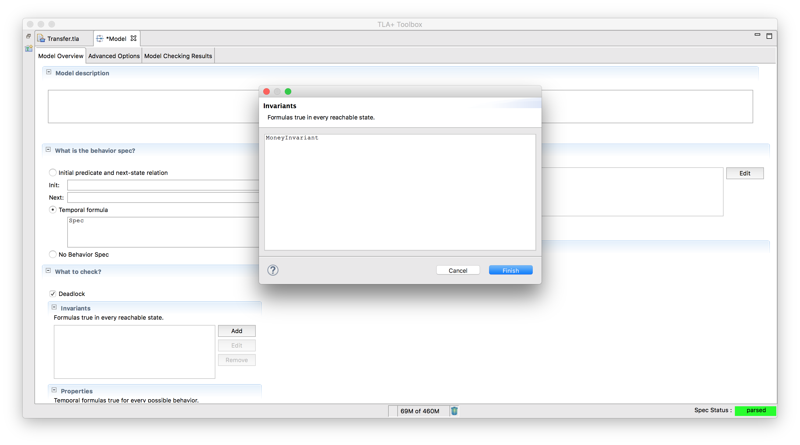
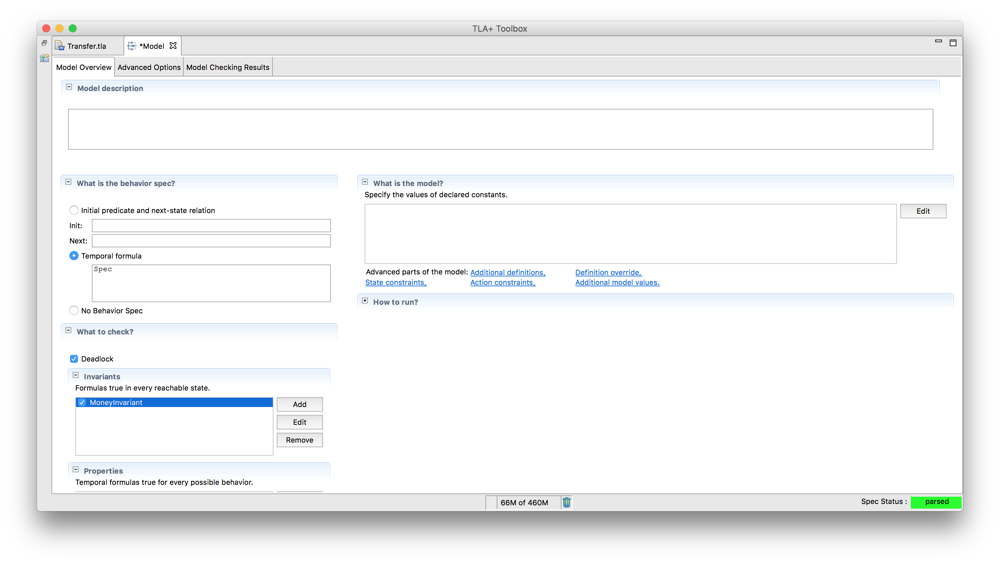
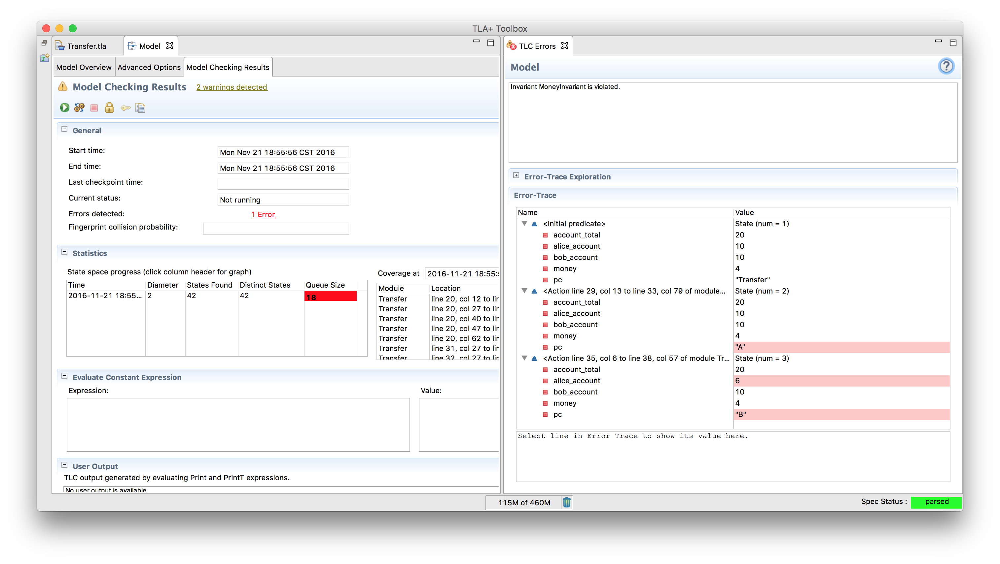
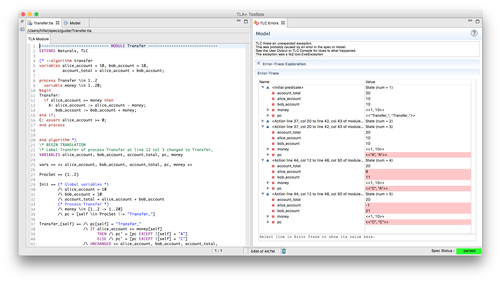

+++
title = "An Example"
weight = 3
+++

Generally the idea of model checking seems appealing in theory, but people are often skeptical that it can be used in practice. So this is a guided example of how to implement a simple spec and find errors. **This example is not necessary to understand the rest of the guide.** Everything here will be covered much more extensively in the following sections. Still, it's worth getting some hands-on experience.

## The Problem

You’re writing software for a bank. You have Alice and Bob as clients, each with a certain amount of money in their accounts. Alice wants to send some money to Bob. How do you model this? Assume all you care about is their bank accounts.

### Step One

Here’s one way:

{}

Before we start messing with it, let's break down the current syntax we have. Since TLA+ is a specification language, it enforces certain restrictions on the structure of your program. 

* If the filename is "transfer", the first line of the spec must be `---- MODULE transfer ----`. You must have at least four dashes on each side. Similarly, the last line must be at least four equal signs. Anything before the `---- MODULE` or after the bottom is ignored.
* EXTENDS is the equivalent of an import statement.
* We write line comments with `\*` and block comments with `(* *)`. Note that the algorithm is in a comment block. This is intentional. Since PlusCal algorithms aren't syntatically valid TLA+, we can't run it in a TLA file. Instead, you leave them in comments and let the PlusCal translator translate it.
* `variables` is, shockingly enough, variables. Note that we use `=` when declaring variables, while in the algorithm itself we use `:=`. Outside of variable definition `=` is the comparison operator. Not equals is written as `/=`. So we have the expressions `1 + 2 = 3` and  `2 + 3 /= 4`.
* `A:` and `B:` are labels. They define the steps the algorithm takes. Understanding how labels work is critical to writing more complex algorithms, as they define the places where your concurrency can go horribly awry. We'll be diving into them a bit deeper later.

So how do we run this? Well, we can't. First of all, it's not real code, we have to transpile it first. Also, we don't exactly 'run' it. Instead, we design models to test against it. Let's get that set up right now.

### TLA+ Toolbox

The [TLA+ Toolbox] (https://lamport.azurewebsites.net/tla/toolbox.html#downloading) is the IDE for TLA+. Using TLA+ has enough moving parts that using an IDE is the right choice here, regardless of your preferences.

Let's open it up and add our current project. There's two parts to a specification: the modules and the models. Modules have our code, models test them. Try creating a new spec with the above code in it, and then translate that into TLA+. You can find translation under `TK` or using a shortcut. On Windows the shortcut is ctrl-T and on Mac it’s ⌘T).

Immediately, you’ll see a bunch of code appear. That’s the TLA+ translation of our PlusCal algorithm, aka what the model checker will actually run. Speaking of which, let’s also create a model:

It’s okay for the model to be empty right now; even without any configuration we’ll be able to use it in the next section.

### Assertions and Sets

Can Alice's account go negative? Right now our spec allows that, which we don't want. We can start by adding a basic assert check after the transaction. This is the same as asserts in any other language. TLA+ also has vastly more powerful tools for checking contracts and properties, but let's start small.

Here's what our code looks like with the assert:

{}

If we run this, the model will successfully pass.

At the very least, it works for the one number we tried. That doesn't mean it works for all cases. When testing, it’s often hard to choose just the right test cases to surface the bugs you want to find. This is because most languages make it easy to test a specific state but not a large set of them. In TLA+, though, testing a wide range is simple:

{}

The only thing we changed was `money = 5` to `money \in 1..20`. That means, as you probably can tell, that for the purposes of this algorithm money can be any number from 1 to 20. This means that when checking a model there are 20 possible starting states: (10, 10, 1), (10, 10, 2), etc. TLA+ will try all twenty possibilities and see if any of them break the assertion. This scales; if we wrote `alice_account \in {5, 10}`, there would be 40 possible starting states.

(`{}` is the set specificer. `a..b` is syntatic sugar for "the set of all integers between a and b inclusive", so `1..3 = {1, 2, 3}`)

When we run this, we immediately get an error:

We can fix this by wrapping the check in an if-block:

{}

Which now runs properly.

Quick aside: this is closer to testing all possible cases, but isn't testing all possible cases. Would the algorithm break if money was, say, 4997? If we actually wanted to test all possible cases, we could replace `money \in 1..20` with `money \in Nat`, where `Nat` is the set of natural numbers. This is perfectly valid TLA+. Unfortunately, it's also something the model checker can't handle. TLC can only check a subset of TLA+, and an infinite of initial states isn't in that subset.

### TLA+ and Invariants

Can you transfer a negative amount of money? We could add an `assert money > 0` to the beginning of the algorithm. This time, though, we're going to introduce a new method in preparation for the next section

{}

A few things should leap out here. First, this isn't part of the PlusCal algorithm. It's pure TLA+ that we put in the bottom of the file so as to be able to reference the transpiled TLA+. TLA+ can reference anything that your PlusCal can, as long as it comes after the `\* END TRANSLATION` marker. Second, it doesn't change anything. Instead, it's just a definition, or _operator_. If money is negative, MoneyNotNegative is false. Otherwise, it's true. Operators are specified with `==`. We can use this operator to test if the money is, well, not negative.

How is this different from `assert`? Assert checks in one place. We can specify MoneyNotNegative as an _Invariant_ of the system, something that must be true in all possible system states. It becomes part of the model, and then it'll check before money is pulled from Alice's account, being the deposit and the withdrawal, etc. If we added a `money := money - 2` step anywhere the MoneyNotNegative invariant will catch that the spec fails when `money = 1`.

### One step further: checking Atomicity

So far we haven't done anything too out of the ordinary. Everything so far is easily coverable in a real system by unit and property tests. There's still a lot more ground to cover, but I want to show that we can already use what we've learned to find more complicated bugs. Alice wants to give Bob 1,000 dollars. If we're unlucky, it could play out like this:

1. System checks that Alice has enough money
2. $1,000 is deducted from her account
3. Eve smashes in the server with a baseball bat
4. Bob never receives the money
5. $1,000 has completely disappeared from the system
6. The SEC shuts you down for fraud.

We already have all of the tools to check this. First, we need to figure out how to represent the broken invariant. We could do that by requiring the total money in the system is always the same:

{}

Then, we declare the checked Invariant to the model:

When we run this, TLC finds a counterexample: between steps A and B the invariant doesn't hold.

How do we solve this? It depends on the level of abstraction we care about. If you were designing a database, you'd want to spec the exact steps required to keep the system consistent. At our level, though, we probably have access to database transactions and can 'abstract out' the atomicity checks. The way we do that is to combine A and B into a single "Transaction" step. That tells TLA+ that both actions happen simultaneously, and the system never passes through an invalid state.

{}

### Multiprocess Algorithms

As a final part of our example, let's discuss concurrency. Right now our system seems stable enough, for one transfer between two parties. What happens, though, if people can make multiple transfers? Each one uses the same account state but operates independently of each other. Can we test the behavior of that system?

PlusCal supports multiprocess algorithms. The processes can be completely different algorithms happening concurrently or the same one happening in parallel (or both). The latter is what we want to spec. Here's what it would look like if we could make two transactions:

{}

The accounts are global variables, while money is a local variable to the process. This means that there are 400 possible initial states, as the first transfer can be one dollar and the second seven. However, there are actually 2400 possible behaviors! That's because TLC can choose which order to run the processes in, as well as how to interleave them.

However, `MoneyNotNegative` doesn't make sense anymore, since there's now two values for money. If you'd added that to the model make sure to uncheck it to avoid an error and rerun. You should get the following error:

There's a gap between when we check that Alice has enough money and when we actually transfer the money. With one process this wasn't a problem, but with two, it means her account can go negative. TLC is nice enough to provide the initial state and steps required to reproduce the bug.

This example only covers a small subsection of the tool; we haven't even touched temporal properties, liveness, or set manipulation yet. Hopefully, though, this has shown you that even a cursory knowledge of TLA+ is enough to discover interesting problems.
