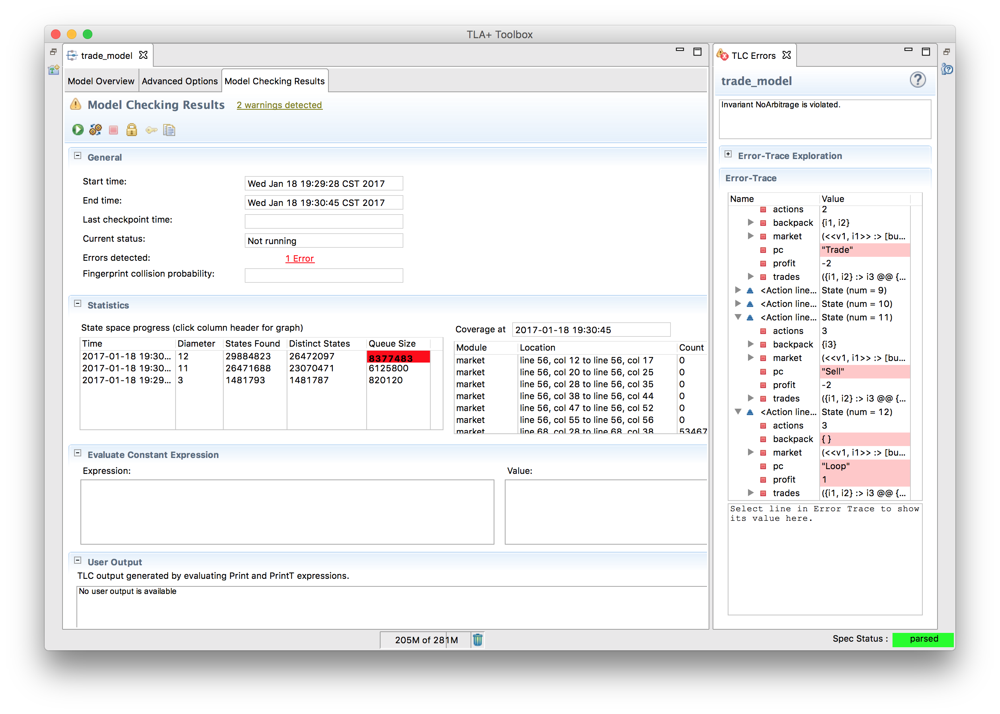

+++
title = "Example: Arbitrage"
weight = 20
+++

Consider a situation where a buyer has access to some number of vendors who buy and sell the same set of items. While each vendor has the exact same inventory, they each buy and sell for a different price; buying at a lower price than they sell, of course. Is there a potential for arbitrage?

To start, we need to specify the data structure we use. The simplest way is to say that for each combination of vendor and item, they have a buy price and a sell price. That suggests a function that maps `Vendor \X Item` tuples to some `[buy |-> X , sell |-> Y]` structure. To provide variance we instead use `[buy : P, sell : P]`; remember, that's the set of all such structures. So each "Market" is a set of vendors and items, and how much they buy and sell that item for each pair.

```
ValidMarkets == [V \X I -> [buy : P, sell : P]]
```

Let's build a simple PlusCal algorithm around this. On every step, you can either buy an item you don't have or sell an item you do.

{}

We don't care about deadlock, so we can uncheck that as a thing to check and add `NoArbitrage` as an invariant. Try making a model with 1 item, 1 vendor, a max price of 6, and a max actions of 5. This will fail; nothing's stopping a vendor from buying an item for more than they would sell it. What we want to do is ban that:

``` tla
ValidMarkets == LET Markets == [V \X I -> [buy : P, sell : P]]
                IN {m \in Markets :
                    \A item \in I, vendor \in V:
                      m[<<vendor, item>>].buy <= m[<<vendor, item>>].sell
                   }
```

Confirm that works. Now rerun the model with 2, then 3, then 4 items, comparing all of the run times. How does the runtime change?

In this case, by inspection of the model, we see that items don't 'interact' with each other. For optimization reasons, we can run our model with just one item. One thing that does 'interact', though, are the vendors. What happens when you run the model with 1 item and 2 vendors?

We can't require that every vendor sells items for more than they buy them; vendors have to sell for more than _any_ vendor buys them.

{}

Rerun this and confirm it matches the spec.

### Trades

We can be reasonably confident there are no arbitrage opportunities here. What if we make the specification a little more complex? In addition to having buying items, let's imagine that you can also barter; you can convert some items into other items. To keep the system simple we'll assume you 'lose' quantity here: if you trade away N items, you can get at most N-1 back.

``` tla
ValidTrades == LET Trades == [SUBSET I -> SUBSET I]
               IN { T \in Trades :
                    \A s \in DOMAIN T :
                      Cardinality(s) > Cardinality(T[s])
                      }
```

This requires us to extend FiniteSets. Note there are some weird cases here: for example, you can trade an item for nothing. However, these are all strictly bad options, so it's only an optimization problem. A big optimization problem, it turns out; With three items, `Trades` has approximately 16 million elements. So instead we want to do a preoptimization of only mapping sets to individual items.

``` tla
ValidTrades == [{ i \in SUBSET I : Cardinality(i) > 1} -> I]
```
Here's the full code, along with the ability to trade:

{}

In this one, we're less interested in arbitrage between vendors as we are between trading. If we run the model, it will pass. Looking back, we have a problem with our model: since there are only two items available, all trades will just cause you to lose an item. We can prevent that kind of error by adding a guard on trades:

``` tla
ASSUME ValidTrades # {}
```

So we need to run this with at least three items. Since vendor arbitrage doesn't matter, we can drop to one vendor to speed up our checks. When we rerun, we get a spec failure:



What happens if the buyer can buy two cheap items and trade for a third expensive item, which they sell back. That's arbitrage for you. Besides the spec failure, there's a couple of interesting points of note. The first is that the smallest error in the spec required four actions on the part of the buyer. If we capped `MaxActions` at 3, we would not have detected the bug.

The other is that, at least on my laptop, it took almost two minutes to find the error. If I remove the invariant check, it will take six minutes to explore the whole state space. We can reduce the time by making `Items` a symmetry set, in which case TLC finds the error in a little over 20 seconds. Symmetry sets can be very beneficial, and this is a case where it doesn't change the rigor of your spec.
