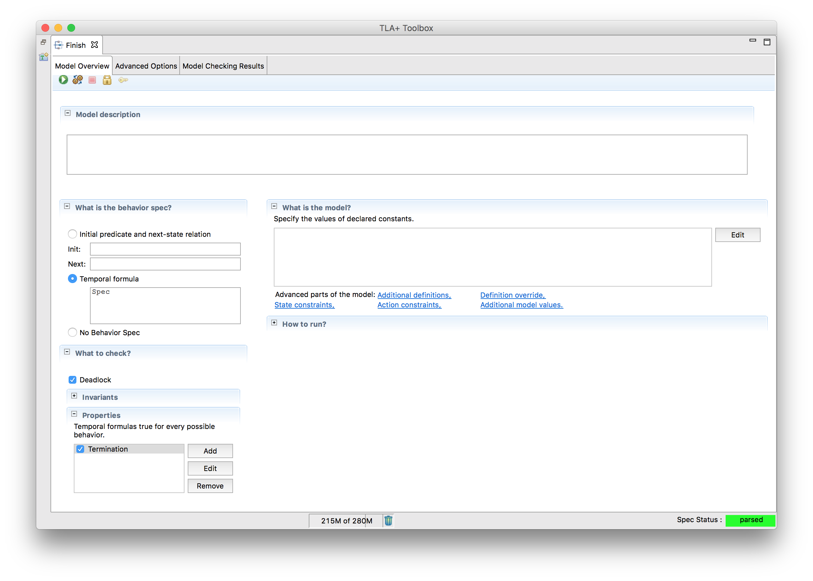

+++
title = "Termination"
weight = 0.5
+++

Will the following PlusCal snippet ever finish?

{}

The most common temporal logic you'll want to check is _Termination_, and TLC provides a handy button to test just that.

This will succeed if, for all behaviors, the spec _ends_. Let's see what happens when we run this:

Well, that was certainly unexpected! This is called _stuttering_. The problem is that the system can choose not to run any step at all. This has never been a problem before because we were making sure things didn't break if time passed, but now things break if time doesn't pass.

How do we get around this? Just put `PlusCal options (termination)` in a comment. That tells TLC that it must run everything it can and can't just stutter. More specifically, it enforces _fairness_: if a given label is always enabled, at some point that step must occur. When we add this, the spec passes as normal.

I'm deliberately glazing over stuttering and fairness; they're useful topics, but complex enough that it's outside of the scope of this guide. More relevant to our case, though, is that I also introduced translation options. The only one we use is terminate; for the others, I'll have to defer to the p-manual to explain it better.

